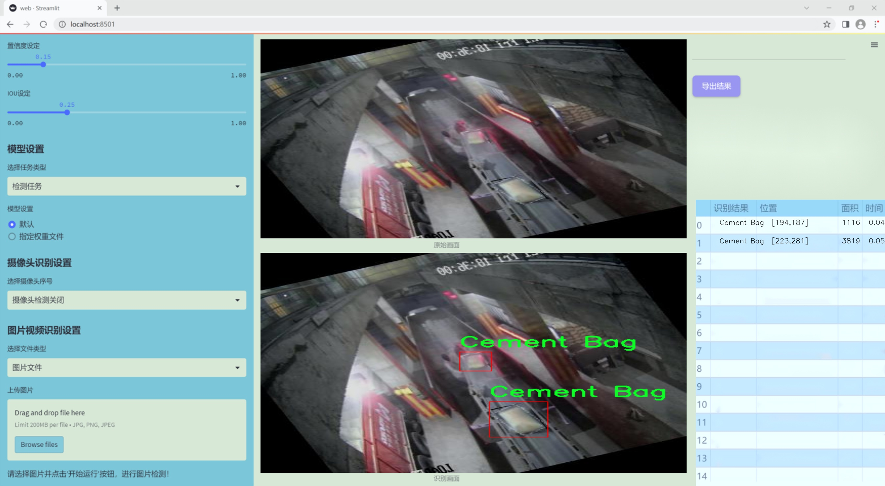
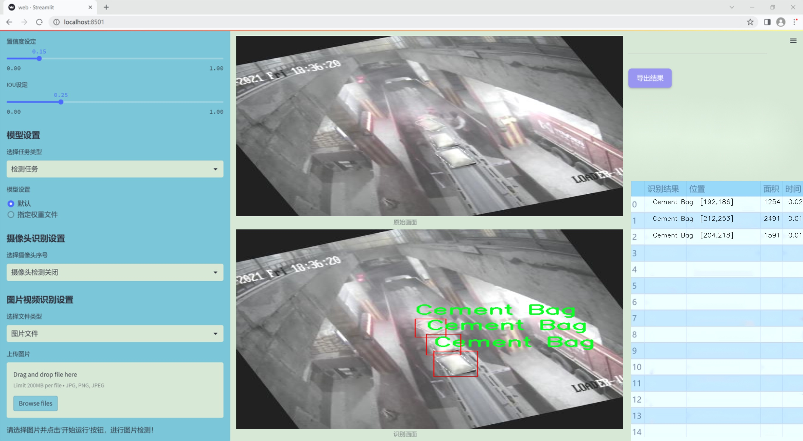
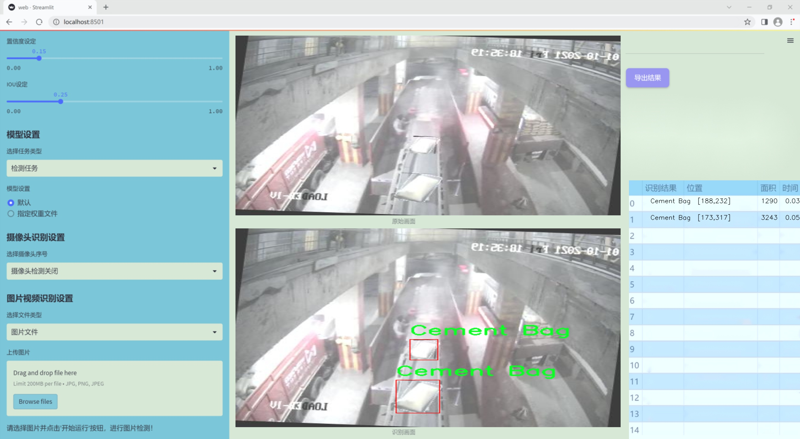
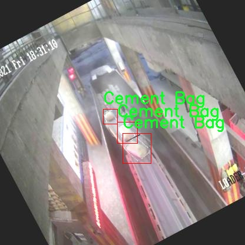
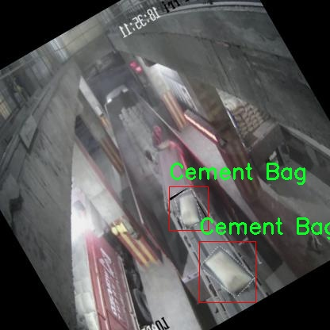
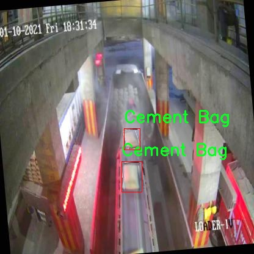
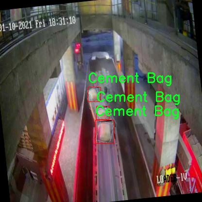
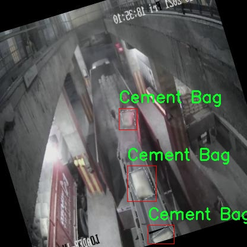

### 1.背景意义

研究背景与意义

随着建筑行业的快速发展，水泥作为一种重要的建筑材料，其需求量逐年增加。水泥袋的生产、运输和存储过程中，确保水泥袋的质量和数量至关重要。然而，传统的人工检测方法不仅效率低下，而且容易受到人为因素的影响，导致漏检或误检现象的发生。因此，开发一种高效、准确的水泥袋检测系统显得尤为重要。

近年来，深度学习技术在目标检测领域取得了显著进展，尤其是YOLO（You Only Look Once）系列模型因其高效性和实时性受到广泛关注。YOLOv11作为该系列的最新版本，具备更强的特征提取能力和更快的推理速度，适合于复杂环境下的目标检测任务。本研究旨在基于改进的YOLOv11模型，构建一个专门针对水泥袋的检测系统，以提高水泥袋的检测效率和准确性。

本项目将使用包含2200张水泥袋图像的数据集，涵盖了不同环境、角度和光照条件下的水泥袋样本。这一数据集的多样性为模型的训练和测试提供了丰富的基础，有助于提升模型的泛化能力。通过对YOLOv11模型的改进，我们将优化其在水泥袋检测中的表现，探索适合该特定应用场景的网络结构和参数设置。

该研究不仅具有重要的理论意义，还能为实际应用提供有效的解决方案。通过实现自动化的水泥袋检测系统，可以显著提高生产和物流环节的效率，降低人工成本，减少人为错误，进而推动建筑行业的智能化发展。

### 2.视频效果

[2.1 视频效果](https://www.bilibili.com/video/BV1uPD6YcE5e/)

### 3.图片效果







##### [项目涉及的源码数据来源链接](https://kdocs.cn/l/cszuIiCKVNis)**

注意：本项目提供训练的数据集和训练教程,由于版本持续更新,暂不提供权重文件（best.pt）,请按照6.训练教程进行训练后实现上图演示的效果。

### 4.数据集信息

##### 4.1 本项目数据集类别数＆类别名

nc: 1
names: ['Cement Bag']


该项目为【目标检测】数据集，请在【训练教程和Web端加载模型教程（第三步）】这一步的时候按照【目标检测】部分的教程来训练

##### 4.2 本项目数据集信息介绍

本项目数据集信息介绍

本项目所使用的数据集名为“WC-TL”，专门用于训练和改进YOLOv11模型，以实现高效的水泥袋检测系统。该数据集的设计旨在提供一个高质量的样本库，以便在各种环境下对水泥袋进行准确识别和定位。数据集中包含的类别数量为1，具体类别为“Cement Bag”，这意味着所有的数据样本均围绕这一特定物体展开，确保模型在识别水泥袋时的专注性和准确性。

在数据集的构建过程中，我们采集了多种场景下的水泥袋图像，包括不同的拍摄角度、光照条件和背景环境。这种多样性使得模型能够在训练过程中学习到水泥袋的不同特征，从而提高其在实际应用中的鲁棒性和适应性。此外，数据集中的图像经过精心标注，确保每个水泥袋的边界框和类别标签准确无误，这对于后续的模型训练至关重要。

为了进一步增强数据集的有效性，我们还应用了一些数据增强技术，如随机裁剪、旋转、亮度调整等。这些技术不仅增加了数据集的样本数量，还提升了模型在面对不同条件下的泛化能力。通过这些措施，我们期望训练出的YOLOv11模型能够在实际应用中快速、准确地检测水泥袋，从而为相关行业提供有效的技术支持。

总之，WC-TL数据集的构建和使用为水泥袋检测系统的研发奠定了坚实的基础，助力于提升自动化检测的效率和准确性，为未来的研究和应用提供了宝贵的数据资源。











### 5.全套项目环境部署视频教程（零基础手把手教学）

[5.1 所需软件PyCharm和Anaconda安装教程（第一步）](https://www.bilibili.com/video/BV1BoC1YCEKi/?spm_id_from=333.999.0.0&vd_source=bc9aec86d164b67a7004b996143742dc)


[5.2 安装Python虚拟环境创建和依赖库安装视频教程（第二步）](https://www.bilibili.com/video/BV1ZoC1YCEBw?spm_id_from=333.788.videopod.sections&vd_source=bc9aec86d164b67a7004b996143742dc)

### 6.改进YOLOv11训练教程和Web_UI前端加载模型教程（零基础手把手教学）

[6.1 改进YOLOv11训练教程和Web_UI前端加载模型教程（第三步）](https://www.bilibili.com/video/BV1BoC1YCEhR?spm_id_from=333.788.videopod.sections&vd_source=bc9aec86d164b67a7004b996143742dc)


按照上面的训练视频教程链接加载项目提供的数据集，运行train.py即可开始训练



     Epoch   gpu_mem       box       obj       cls    labels  img_size
     1/200     20.8G   0.01576   0.01955  0.007536        22      1280: 100%|██████████| 849/849 [14:42<00:00,  1.04s/it]
               Class     Images     Labels          P          R     mAP@.5 mAP@.5:.95: 100%|██████████| 213/213 [01:14<00:00,  2.87it/s]
                 all       3395      17314      0.994      0.957      0.0957      0.0843

     Epoch   gpu_mem       box       obj       cls    labels  img_size
     2/200     20.8G   0.01578   0.01923  0.007006        22      1280: 100%|██████████| 849/849 [14:44<00:00,  1.04s/it]
               Class     Images     Labels          P          R     mAP@.5 mAP@.5:.95: 100%|██████████| 213/213 [01:12<00:00,  2.95it/s]
                 all       3395      17314      0.996      0.956      0.0957      0.0845

     Epoch   gpu_mem       box       obj       cls    labels  img_size
     3/200     20.8G   0.01561    0.0191  0.006895        27      1280: 100%|██████████| 849/849 [10:56<00:00,  1.29it/s]
               Class     Images     Labels          P          R     mAP@.5 mAP@.5:.95: 100%|███████   | 187/213 [00:52<00:00,  4.04it/s]
                 all       3395      17314      0.996      0.957      0.0957      0.0845


###### [项目数据集下载链接](https://kdocs.cn/l/cszuIiCKVNis)

### 7.原始YOLOv11算法讲解


##### YOLOv11三大损失函数

YOLOv11（You Only Look Once）是一种流行的目标检测算法，其损失函数设计用于同时优化分类和定位任务。YOLO的损失函数通常包括几个部分：
**分类损失、定位损失（边界框回归损失）和置信度损失** 。其中，

  1. box_loss（边界框回归损失）是用于优化预测边界框与真实边界框之间的差异的部分。

  2. cls_loss（分类损失）是用于优化模型对目标类别的预测准确性的部分。分类损失确保模型能够正确地识别出图像中的对象属于哪个类别。

  3. dfl_loss（Distribution Focal Loss）是YOLO系列中的一种损失函数，特别是在一些改进版本如YOLOv5和YOLOv7中被引入。它的主要目的是解决目标检测中的类别不平衡问题，并提高模型在处理小目标和困难样本时的性能。

##### 边界框回归损失详解

box_loss（边界框回归损失）是用于优化预测边界框与真实边界框之间的差异的部分。


##### box_loss 的具体意义


##### 为什么需要 box_loss

  * 精确定位：通过最小化中心点坐标损失和宽高损失，模型能够更准确地预测目标的位置和大小。
  * 平衡不同类型的目标：使用平方根来处理宽高损失，可以更好地平衡不同大小的目标，确保小目标也能得到足够的关注。
  * 稳定训练：适当的损失函数设计有助于模型的稳定训练，避免梯度爆炸或消失等问题。

##### 分类损失详解

在YOLO（You Only Look
Once）目标检测算法中，cls_loss（分类损失）是用于优化模型对目标类别的预测准确性的部分。分类损失确保模型能够正确地识别出图像中的对象属于哪个类别。下面是关于cls_loss的详细解读：

##### 分类损失 (cls_loss) 的具体意义

  
分类损失通常使用交叉熵损失（Cross-Entropy
Loss）来计算。交叉熵损失衡量的是模型预测的概率分布与真实标签之间的差异。在YOLO中，分类损失的具体形式如下：


##### 为什么需要 cls_loss

  * 类别识别：cls_loss 确保模型能够正确识别出图像中的目标属于哪个类别。这对于目标检测任务至关重要，因为不仅需要知道目标的位置，还需要知道目标的类型。

  * 多类别支持：通过最小化分类损失，模型可以处理多个类别的目标检测任务。例如，在道路缺陷检测中，可能需要识别裂缝、坑洞、路面破损等多种类型的缺陷。

  * 提高准确性：分类损失有助于提高模型的分类准确性，从而提升整体检测性能。通过优化分类损失，模型可以更好地学习不同类别之间的特征差异。

##### 分布损失详解

`dfl_loss`（Distribution Focal
Loss）是YOLO系列中的一种损失函数，特别是在一些改进版本如YOLOv5和YOLOv7中被引入。它的主要目的是解决目标检测中的类别不平衡问题，并提高模型在处理小目标和困难样本时的性能。下面是对`dfl_loss`的详细解读：

##### DFL Loss 的背景

在目标检测任务中，类别不平衡是一个常见的问题。某些类别的样本数量可能远远多于其他类别，这会导致模型在训练过程中对常见类别的学习效果较好，而对罕见类别的学习效果较差。此外，小目标和困难样本的检测也是一个挑战，因为这些目标通常具有较少的特征信息，容易被忽略或误分类。

为了应对这些问题，研究者们提出了多种改进方法，其中之一就是`dfl_loss`。`dfl_loss`通过引入分布焦点损失来增强模型对困难样本的关注，并改善类别不平衡问题。

##### DFL Loss 的定义

DFL Loss
通常与传统的交叉熵损失结合使用，以增强模型对困难样本的学习能力。其核心思想是通过对每个类别的预测概率进行加权，使得模型更加关注那些难以正确分类的样本。

DFL Loss 的公式可以表示为：


##### DFL Loss 的具体意义**

  * **类别不平衡：** 通过引入平衡因子 α，DFL Loss 可以更好地处理类别不平衡问题。对于少数类别的样本，可以通过增加其权重来提升其重要性，从而提高模型对这些类别的检测性能。
  *  **困难样本：** 通过聚焦参数 γ，DFL Loss 可以让模型更加关注那些难以正确分类的样本。当 
  * γ 较大时，模型会对那些预测概率较低的样本给予更多的关注，从而提高这些样本的分类准确性。
  *  **提高整体性能** ：DFL Loss 结合了传统交叉熵损失的优势，并通过加权机制增强了模型对困难样本的学习能力，从而提高了整体的检测性能。


### 8.200+种全套改进YOLOV11创新点原理讲解

#### 8.1 200+种全套改进YOLOV11创新点原理讲解大全

由于篇幅限制，每个创新点的具体原理讲解就不全部展开，具体见下列网址中的改进模块对应项目的技术原理博客网址【Blog】（创新点均为模块化搭建，原理适配YOLOv5~YOLOv11等各种版本）

[改进模块技术原理博客【Blog】网址链接](https://gitee.com/qunmasj/good)


#### 8.2 精选部分改进YOLOV11创新点原理讲解

###### 这里节选部分改进创新点展开原理讲解(完整的改进原理见上图和[改进模块技术原理博客链接](https://gitee.com/qunmasj/good)【如果此小节的图加载失败可以通过CSDN或者Github搜索该博客的标题访问原始博客，原始博客图片显示正常】


### HRNet V2简介
现在设计高低分辨率融合的思路主要有以下四种：


（a）对称结构。如U-Net、Hourglass等，都是先下采样再上采样，上下采样过程对称。

（b）级联金字塔。如refinenet等，高低分辨率融合时经过卷积处理。

（c）简单的baseline，用转职卷积进行上采样。

（d）扩张卷积。如deeplab等，增大感受野，减少下采样次数，可以无需跳层连接直接进行上采样。

（b）（c）都是使用复杂一些的网络进行下采样（如resnet、vgg），再用轻量级的网络进行上采样。

HRNet V1是在（b）的基础上进行改进，从头到尾保持大的分辨率表示。然而HRNet V1仅是用在姿态估计领域的，HRNet V2对它做小小的改进可以使其适用于更广的视觉任务。这一改进仅仅增加了较小的计算开销，但却提升了较大的准确度。

#### 网络结构图：


这个结构图简洁明了就不多介绍了，首先图2的输入是已经经过下采样四倍的feature map，横向的conv block指的是basicblock 或 bottleblock，不同分辨率之间的多交叉线部分是multi-resolution convolution（多分辨率组卷积）。

到此为止HRNet V2和HRNet V1是完全一致的。

区别之处在于这个基网络上加的一个head：


图3介绍的是接在图2最后的head。（a）是HRNet V1的头，很明显他只用了大分辨率的特征图。（b）（c）是HRNet V2的创新点，（b）用与语义分割，（c）用于目标检测。除此之外作者还在实验部分介绍了用于分类的head，如图4所示。


#### 多分辨率block：


一个多分辨率block由多分辨率组卷积（a）和多分辨率卷积（b）组成。（c）是一个正常卷积的展开，（b）的灵感来源于（c）。代码中（a）部分由Bottleneck和BasicBlock组成。

多分辨率卷积和正常卷积的区别：（1）多分辨率卷积中，每个通道的subset的分辨率都不一样。（2）通道之间的连接如果是降分辨率，则用的是3x3的2stride的卷积，如果是升分辨率，用的是双线性最邻近插值上采样。


### 9.系统功能展示

图9.1.系统支持检测结果表格显示

  图9.2.系统支持置信度和IOU阈值手动调节

  图9.3.系统支持自定义加载权重文件best.pt(需要你通过步骤5中训练获得)

  图9.4.系统支持摄像头实时识别

  图9.5.系统支持图片识别

  图9.6.系统支持视频识别

  图9.7.系统支持识别结果文件自动保存

  图9.8.系统支持Excel导出检测结果数据


### 10. YOLOv11核心改进源码讲解

#### 10.1 predict.py

以下是对给定代码的核心部分进行分析和详细注释的结果：

```python
# 引入必要的模块和类
from ultralytics.engine.predictor import BasePredictor
from ultralytics.engine.results import Results
from ultralytics.utils import ops

class DetectionPredictor(BasePredictor):
    """
    DetectionPredictor类扩展了BasePredictor类，用于基于检测模型进行预测。
    
    示例用法：
        ```python
        from ultralytics.utils import ASSETS
        from ultralytics.models.yolo.detect import DetectionPredictor

        args = dict(model='yolov8n.pt', source=ASSETS)
        predictor = DetectionPredictor(overrides=args)
        predictor.predict_cli()
        ```
    """

    def postprocess(self, preds, img, orig_imgs):
        """
        对预测结果进行后处理，并返回Results对象的列表。
        
        参数:
            preds: 模型的预测结果
            img: 输入图像
            orig_imgs: 原始图像（可能是torch.Tensor或numpy数组）
        
        返回:
            results: 包含处理后结果的Results对象列表
        """
        # 使用非极大值抑制（NMS）来过滤预测框
        preds = ops.non_max_suppression(
            preds,
            self.args.conf,  # 置信度阈值
            self.args.iou,   # IOU阈值
            agnostic=self.args.agnostic_nms,  # 是否使用类别无关的NMS
            max_det=self.args.max_det,  # 最大检测框数量
            classes=self.args.classes,   # 需要检测的类别
        )

        # 如果输入的原始图像不是列表，则将其转换为numpy数组
        if not isinstance(orig_imgs, list):  # 输入图像是torch.Tensor而不是列表
            orig_imgs = ops.convert_torch2numpy_batch(orig_imgs)

        results = []  # 初始化结果列表
        for i, pred in enumerate(preds):  # 遍历每个预测结果
            orig_img = orig_imgs[i]  # 获取对应的原始图像
            # 将预测框的坐标从缩放后的图像尺寸转换为原始图像尺寸
            pred[:, :4] = ops.scale_boxes(img.shape[2:], pred[:, :4], orig_img.shape)
            img_path = self.batch[0][i]  # 获取图像路径
            # 创建Results对象并添加到结果列表中
            results.append(Results(orig_img, path=img_path, names=self.model.names, boxes=pred))
        
        return results  # 返回处理后的结果列表
```

### 代码核心部分分析：
1. **类定义**：`DetectionPredictor`类继承自`BasePredictor`，用于处理基于YOLO模型的目标检测任务。
2. **后处理方法**：`postprocess`方法是核心功能之一，负责对模型的预测结果进行后处理，包括应用非极大值抑制（NMS）来过滤掉重叠的检测框，并将预测框的坐标从缩放后的图像尺寸转换为原始图像尺寸。
3. **结果封装**：将处理后的结果封装成`Results`对象，便于后续使用和分析。

### 重要功能：
- **非极大值抑制**：有效减少重复检测，提高检测精度。
- **坐标缩放**：确保检测框在原始图像中的位置正确。
- **结果封装**：将结果以结构化的方式返回，便于后续处理和展示。

这个文件是一个名为 `predict.py` 的 Python 脚本，主要用于基于检测模型进行预测。它继承自 `BasePredictor` 类，属于 Ultralytics YOLO 项目的一部分，遵循 AGPL-3.0 许可证。

在这个脚本中，定义了一个名为 `DetectionPredictor` 的类，该类专门用于处理目标检测任务。类的文档字符串中给出了使用示例，展示了如何通过导入必要的模块和类来创建一个预测器实例，并调用 `predict_cli` 方法进行预测。

类中有一个重要的方法 `postprocess`，用于对模型的预测结果进行后处理。该方法接收三个参数：`preds`（模型的预测结果）、`img`（输入图像）和 `orig_imgs`（原始图像）。在方法内部，首先调用 `ops.non_max_suppression` 函数对预测结果进行非极大值抑制，以减少重叠的检测框。这个过程使用了一些参数，如置信度阈值、IOU 阈值、是否使用类别无关的 NMS、最大检测框数量以及需要检测的类别。

接下来，方法检查 `orig_imgs` 是否为列表，如果不是，则将其转换为 NumPy 数组格式。然后，创建一个空的 `results` 列表，用于存储处理后的结果。对于每一个预测结果，方法会将其框的坐标缩放到原始图像的尺寸，并将结果封装为 `Results` 对象，包括原始图像、图像路径、模型的类别名称和预测框。最后，返回处理后的结果列表。

总的来说，这个文件实现了一个用于目标检测的预测器，能够处理模型的输出并将其转换为可用的结果格式，便于后续的分析和展示。

#### 10.2 attention.py

以下是代码中最核心的部分，并附上详细的中文注释：

```python
import torch
from torch import nn

class EMA(nn.Module):
    """
    EMA (Exponential Moving Average) 模块
    用于对输入特征进行加权平均，以增强特征表示。
    """
    def __init__(self, channels, factor=8):
        super(EMA, self).__init__()
        self.groups = factor  # 将通道分成多个组
        assert channels // self.groups > 0  # 确保每组有至少一个通道
        self.softmax = nn.Softmax(-1)  # Softmax层
        self.agp = nn.AdaptiveAvgPool2d((1, 1))  # 自适应平均池化
        self.pool_h = nn.AdaptiveAvgPool2d((None, 1))  # 对高度进行池化
        self.pool_w = nn.AdaptiveAvgPool2d((1, None))  # 对宽度进行池化
        self.gn = nn.GroupNorm(channels // self.groups, channels // self.groups)  # 组归一化
        self.conv1x1 = nn.Conv2d(channels // self.groups, channels // self.groups, kernel_size=1)  # 1x1卷积
        self.conv3x3 = nn.Conv2d(channels // self.groups, channels // self.groups, kernel_size=3, padding=1)  # 3x3卷积

    def forward(self, x):
        b, c, h, w = x.size()  # 获取输入的批量大小、通道数、高度和宽度
        group_x = x.reshape(b * self.groups, -1, h, w)  # 将输入重塑为多个组
        x_h = self.pool_h(group_x)  # 对高度进行池化
        x_w = self.pool_w(group_x).permute(0, 1, 3, 2)  # 对宽度进行池化并转置
        hw = self.conv1x1(torch.cat([x_h, x_w], dim=2))  # 连接并通过1x1卷积
        x_h, x_w = torch.split(hw, [h, w], dim=2)  # 分割为高度和宽度
        x1 = self.gn(group_x * x_h.sigmoid() * x_w.permute(0, 1, 3, 2).sigmoid())  # 通过组归一化
        x2 = self.conv3x3(group_x)  # 通过3x3卷积
        x11 = self.softmax(self.agp(x1).reshape(b * self.groups, -1, 1).permute(0, 2, 1))  # 计算权重
        x12 = x2.reshape(b * self.groups, c // self.groups, -1)  # 重塑
        x21 = self.softmax(self.agp(x2).reshape(b * self.groups, -1, 1).permute(0, 2, 1))  # 计算权重
        x22 = x1.reshape(b * self.groups, c // self.groups, -1)  # 重塑
        weights = (torch.matmul(x11, x12) + torch.matmul(x21, x22)).reshape(b * self.groups, 1, h, w)  # 计算最终权重
        return (group_x * weights.sigmoid()).reshape(b, c, h, w)  # 返回加权后的特征

class SimAM(nn.Module):
    """
    SimAM (Similarity Attention Module) 模块
    用于增强特征表示，通过相似性计算来生成注意力权重。
    """
    def __init__(self, e_lambda=1e-4):
        super(SimAM, self).__init__()
        self.activaton = nn.Sigmoid()  # Sigmoid激活函数
        self.e_lambda = e_lambda  # 正则化参数

    def forward(self, x):
        b, c, h, w = x.size()  # 获取输入的批量大小、通道数、高度和宽度
        n = w * h - 1  # 计算总的像素数
        x_minus_mu_square = (x - x.mean(dim=[2, 3], keepdim=True)).pow(2)  # 计算每个像素与均值的平方差
        y = x_minus_mu_square / (4 * (x_minus_mu_square.sum(dim=[2, 3], keepdim=True) / n + self.e_lambda)) + 0.5  # 计算注意力权重
        return x * self.activaton(y)  # 返回加权后的特征

class BiLevelRoutingAttention(nn.Module):
    """
    Bi-Level Routing Attention 模块
    通过双层路由机制实现注意力计算。
    """
    def __init__(self, dim, num_heads=8, n_win=7, qk_scale=None, topk=4):
        super().__init__()
        self.dim = dim  # 输入通道数
        self.n_win = n_win  # 窗口数
        self.num_heads = num_heads  # 注意力头数
        self.qk_dim = dim // num_heads  # 每个头的维度
        self.scale = qk_scale or self.qk_dim ** -0.5  # 缩放因子
        self.router = TopkRouting(qk_dim=self.qk_dim, topk=topk)  # 路由机制
        self.qkv = nn.Linear(dim, dim * 3)  # QKV映射

    def forward(self, x):
        b, c, h, w = x.size()  # 获取输入的批量大小、通道数、高度和宽度
        q, kv = self.qkv(x).chunk(2, dim=-1)  # 计算Q和KV
        # 进行注意力计算...
        return x  # 返回经过注意力计算后的特征
```

以上是代码中几个核心模块的简化版本和注释，主要包括EMA、SimAM和BiLevelRoutingAttention模块。这些模块是实现特征增强和注意力机制的关键部分。

这个程序文件 `attention.py` 实现了一系列与注意力机制相关的深度学习模块，主要用于计算机视觉任务中的特征提取和增强。文件中包含了多个类，每个类实现了不同类型的注意力机制或相关功能。

首先，文件导入了必要的库，包括 PyTorch 和一些其他的模块。接着，定义了一些通用的注意力机制类，如 `EMA`（Exponential Moving Average）和 `SimAM`（Similarity Attention Module），这些模块通过对输入特征进行加权和变换来增强模型的表达能力。

`SpatialGroupEnhance` 类通过对输入特征进行空间分组增强，利用自适应平均池化和卷积操作来提取空间信息。`TopkRouting` 类实现了一种可微分的 Top-k 路由机制，用于选择最重要的特征。

`BiLevelRoutingAttention` 类实现了双层路由注意力机制，结合了全局和局部的特征提取。该类使用了多个子模块，包括 `QKVLinear` 和 `KVGather`，以实现查询、键和值的线性变换和聚合。

`CoordAtt` 和 `TripletAttention` 类则实现了坐标注意力和三元注意力机制，分别关注于空间位置和多种特征的交互。`BAMBlock` 和 `EfficientAttention` 类则提供了基于通道和空间的注意力机制，增强了特征的表达能力。

此外，文件中还实现了一些特定的注意力模块，如 `LSKA`（Large-Separable-Kernel Attention）、`SegNext_Attention` 和 `DAttention`，这些模块针对特定的网络架构和任务进行了优化。

文件的最后部分定义了一些辅助类和函数，如 `Mix` 和 `AFGCAttention`，用于实现特定的功能，如通道注意力和特征混合。

总的来说，这个文件实现了多种注意力机制和模块，旨在提高深度学习模型在视觉任务中的性能，尤其是在特征提取和表示学习方面。每个模块都可以独立使用，也可以组合在一起，形成更复杂的网络结构。

#### 10.3 CSwomTramsformer.py

以下是经过简化和注释的核心代码部分，保留了CSWin Transformer的主要结构和功能。

```python
import torch
import torch.nn as nn
import numpy as np

class Mlp(nn.Module):
    """多层感知机（MLP）模块"""
    def __init__(self, in_features, hidden_features=None, out_features=None, act_layer=nn.GELU, drop=0.):
        super().__init__()
        out_features = out_features or in_features  # 输出特征数
        hidden_features = hidden_features or in_features  # 隐藏层特征数
        self.fc1 = nn.Linear(in_features, hidden_features)  # 第一层线性变换
        self.act = act_layer()  # 激活函数
        self.fc2 = nn.Linear(hidden_features, out_features)  # 第二层线性变换
        self.drop = nn.Dropout(drop)  # Dropout层

    def forward(self, x):
        """前向传播"""
        x = self.fc1(x)  # 线性变换
        x = self.act(x)  # 激活
        x = self.drop(x)  # Dropout
        x = self.fc2(x)  # 线性变换
        x = self.drop(x)  # Dropout
        return x

class CSWinBlock(nn.Module):
    """CSWin Transformer的基本块"""
    def __init__(self, dim, num_heads, mlp_ratio=4., drop=0., attn_drop=0.):
        super().__init__()
        self.dim = dim  # 输入特征维度
        self.num_heads = num_heads  # 注意力头数
        self.mlp_ratio = mlp_ratio  # MLP的隐藏层比率
        self.qkv = nn.Linear(dim, dim * 3)  # 线性变换用于生成Q、K、V
        self.norm1 = nn.LayerNorm(dim)  # 第一层归一化
        self.attn = LePEAttention(dim, num_heads=num_heads, attn_drop=attn_drop)  # 注意力机制
        self.mlp = Mlp(in_features=dim, hidden_features=int(dim * mlp_ratio), out_features=dim)  # MLP
        self.drop = nn.Dropout(drop)  # Dropout层

    def forward(self, x):
        """前向传播"""
        x = self.norm1(x)  # 归一化
        qkv = self.qkv(x).reshape(x.shape[0], -1, 3, self.dim).permute(2, 0, 1, 3)  # 生成Q、K、V
        x = self.attn(qkv)  # 注意力计算
        x = x + self.drop(x)  # 残差连接
        x = x + self.drop(self.mlp(x))  # 残差连接与MLP
        return x

class CSWinTransformer(nn.Module):
    """CSWin Transformer模型"""
    def __init__(self, img_size=640, in_chans=3, num_classes=1000, embed_dim=96, depth=[2, 2, 6, 2], num_heads=12):
        super().__init__()
        self.num_classes = num_classes
        self.embed_dim = embed_dim  # 嵌入维度
        self.stage1_conv_embed = nn.Sequential(
            nn.Conv2d(in_chans, embed_dim, 7, 4, 2),  # 初始卷积层
            nn.LayerNorm(embed_dim)  # 归一化层
        )
        self.stage1 = nn.ModuleList([
            CSWinBlock(dim=embed_dim, num_heads=num_heads) for _ in range(depth[0])  # 第一阶段的CSWinBlock
        ])
        # 后续阶段的块和合并操作可以继续添加

    def forward(self, x):
        """前向传播"""
        x = self.stage1_conv_embed(x)  # 初始卷积嵌入
        for blk in self.stage1:
            x = blk(x)  # 通过每个CSWinBlock
        return x

# 示例模型创建
if __name__ == '__main__':
    inputs = torch.randn((1, 3, 640, 640))  # 随机输入
    model = CSWinTransformer()  # 创建模型
    res = model(inputs)  # 前向传播
    print(res.size())  # 输出结果的尺寸
```

### 代码注释说明：
1. **Mlp类**：实现了一个简单的多层感知机，包含两个线性层和一个激活函数，支持Dropout。
2. **CSWinBlock类**：实现了CSWin Transformer的基本构建块，包含归一化、注意力机制和MLP，支持残差连接。
3. **CSWinTransformer类**：整体模型结构，包含输入嵌入和多个CSWinBlock的堆叠，适用于图像分类任务。
4. **主函数**：创建一个随机输入并通过模型进行前向传播，输出结果的尺寸。

这个程序文件 `CSWinTransformer.py` 实现了 CSWin Transformer 模型，这是一个用于计算机视觉任务的深度学习模型。文件中包含了多个类和函数，用于构建和训练这个模型。

首先，文件引入了必要的库，包括 PyTorch、timm 库（用于处理图像数据和模型的工具）、einops（用于张量重排）等。接着，定义了一些全局变量和常量，主要是模型的不同版本（如 CSWin_tiny、CSWin_small 等）。

接下来，定义了几个重要的类：

1. **Mlp**：这是一个多层感知机（MLP）模块，包含两个线性层和一个激活函数（默认为 GELU）。它的主要功能是对输入进行线性变换和非线性激活。

2. **LePEAttention**：这是一个自定义的注意力机制模块，使用了局部增强位置编码（LePE）。它将输入的特征图分割成小块，并计算注意力权重。该模块的设计考虑了输入的分辨率和分块大小。

3. **CSWinBlock**：这是 CSWin Transformer 的基本构建块，包含了多头注意力机制和 MLP。它将输入特征进行归一化、线性变换，并通过注意力机制和 MLP 进行处理。

4. **Merge_Block**：这个模块用于合并特征图，通常在模型的不同阶段之间使用，以减少特征图的尺寸并增加通道数。

5. **CSWinTransformer**：这是整个模型的主类，负责构建 CSWin Transformer 的各个阶段。它包含多个 CSWinBlock 和 Merge_Block，并实现了前向传播方法。

在模型的初始化过程中，定义了不同阶段的卷积嵌入、块的数量、每个块的头数等参数。通过这些参数，模型可以根据输入图像的大小和通道数动态调整。

此外，文件中还定义了一些辅助函数，例如 `img2windows` 和 `windows2img`，用于将图像从空间域转换到窗口域，以及反向转换。这些函数在注意力机制中起到重要作用。

最后，文件提供了几个函数（如 `CSWin_tiny`、`CSWin_small` 等）用于创建不同规模的 CSWin Transformer 模型，并可以选择加载预训练权重。主程序部分则是一个简单的测试示例，展示了如何创建模型并对随机输入进行前向传播，输出每个阶段的特征图大小。

总体来说，这个文件实现了一个复杂的视觉变换器模型，结合了多种深度学习技术，旨在提高计算机视觉任务的性能。

#### 10.4 head.py

以下是代码中最核心的部分，并附上详细的中文注释：

```python
import torch
import torch.nn as nn
import torch.nn.functional as F
from ..modules import Conv, DFL, make_anchors, dist2bbox

class Detect_DyHead(nn.Module):
    """YOLOv8 检测头，使用动态头进行目标检测。"""
    
    def __init__(self, nc=80, hidc=256, block_num=2, ch=()):
        """初始化检测层。

        参数:
        nc (int): 类别数量。
        hidc (int): 隐藏层通道数。
        block_num (int): 动态头块的数量。
        ch (tuple): 输入通道数的元组。
        """
        super().__init__()
        self.nc = nc  # 类别数量
        self.nl = len(ch)  # 检测层数量
        self.reg_max = 16  # DFL 通道数
        self.no = nc + self.reg_max * 4  # 每个锚点的输出数量
        self.stride = torch.zeros(self.nl)  # 构建时计算的步幅
        self.conv = nn.ModuleList(nn.Sequential(Conv(x, hidc, 1)) for x in ch)  # 输入通道到隐藏层的卷积
        self.dyhead = nn.Sequential(*[DyHeadBlock(hidc) for _ in range(block_num)])  # 动态头块
        self.cv2 = nn.ModuleList(
            nn.Sequential(Conv(hidc, 256, 3), Conv(256, 256, 3), nn.Conv2d(256, 4 * self.reg_max, 1)) for _ in ch
        )  # 第二个卷积层
        self.cv3 = nn.ModuleList(
            nn.Sequential(
                nn.Sequential(Conv(hidc, 256, 3), Conv(256, 256, 1)),
                nn.Sequential(Conv(256, 256, 3), Conv(256, 256, 1)),
                nn.Conv2d(256, self.nc, 1),
            )
            for _ in ch
        )  # 第三个卷积层
        self.dfl = DFL(self.reg_max) if self.reg_max > 1 else nn.Identity()  # DFL层

    def forward(self, x):
        """连接并返回预测的边界框和类别概率。"""
        for i in range(self.nl):
            x[i] = self.conv[i](x[i])  # 对每个输入进行卷积处理
        x = self.dyhead(x)  # 通过动态头处理
        shape = x[0].shape  # 获取输出形状
        for i in range(self.nl):
            x[i] = torch.cat((self.cv2[i](x[i]), self.cv3[i](x[i])), 1)  # 连接第二和第三个卷积层的输出
        if self.training:
            return x  # 如果在训练模式下，返回中间输出
        else:
            self.anchors, self.strides = (x.transpose(0, 1) for x in make_anchors(x, self.stride, 0.5))  # 生成锚点和步幅
            x_cat = torch.cat([xi.view(shape[0], self.no, -1) for xi in x], 2)  # 将输出拼接为 (batch_size, no, -1)
            box, cls = x_cat.split((self.reg_max * 4, self.nc), 1)  # 分割边界框和类别
            dbox = dist2bbox(self.dfl(box), self.anchors.unsqueeze(0), xywh=True, dim=1) * self.strides  # 解码边界框
            y = torch.cat((dbox, cls.sigmoid()), 1)  # 返回边界框和类别概率
            return y

    def bias_init(self):
        """初始化检测头的偏置，警告：需要步幅可用。"""
        for a, b, s in zip(self.cv2, self.cv3, self.stride):
            a[-1].bias.data[:] = 1.0  # 边界框偏置初始化
            b[-1].bias.data[:self.nc] = math.log(5 / self.nc / (640 / s) ** 2)  # 类别偏置初始化

# 这里可以继续添加其他类的核心部分，类似于 Detect_DyHead 类的结构和注释
```

以上代码是 YOLOv8 检测头的核心部分，包含了初始化和前向传播的主要逻辑，以及偏置初始化的功能。注释详细解释了每个参数和步骤的目的，便于理解和维护。

这个程序文件 `head.py` 是一个用于目标检测的深度学习模型的实现，主要是 YOLOv8 系列模型的不同检测头（Detect Head）模块。文件中定义了多个类，每个类实现了不同的检测头，适用于不同的任务和网络结构。以下是对文件内容的详细说明。

首先，文件导入了一些必要的库，包括 PyTorch 及其相关模块，以及一些自定义的模块和函数。这些导入的模块为后续的网络结构构建提供了基础。

接下来，定义了多个检测头类，主要包括 `Detect_DyHead`、`Detect_AFPN_P345`、`Detect_Efficient` 等。这些类继承自 `nn.Module`，并实现了各自的初始化方法和前向传播方法。

`Detect_DyHead` 类是 YOLOv8 的检测头，使用了动态头（DyHead）来进行目标检测。初始化方法中定义了多个卷积层和动态头块，前向传播方法则实现了特征图的处理和目标框及类别概率的预测。它还处理了动态锚框的生成和形状的更新。

`Detect_AFPN_P345` 类实现了使用自适应特征金字塔网络（AFPN）的检测头，适用于不同的检测层。它的结构与 `Detect_DyHead` 类似，但使用了 AFPN 来增强特征提取能力。

`Detect_Efficient` 类则是一个高效的检测头，设计上更轻量化，适合在资源受限的环境中使用。它通过使用分组卷积和其他优化技术来减少计算量。

此外，文件中还定义了一些其他类型的检测头，例如 `Detect_LSCD`、`Detect_LADH`、`Detect_TADDH` 等，这些类实现了不同的网络结构和功能，适用于不同的任务，如关键点检测、旋转框检测等。

每个检测头类的 `forward` 方法都负责处理输入特征图，进行卷积操作，生成目标框和类别概率，并在训练和推理阶段执行不同的操作。在推理阶段，模型会生成锚框并进行后处理，以便得到最终的检测结果。

最后，文件中还包含了一些辅助函数和类，例如 `Scale` 和 `Conv_GN`，用于实现可学习的缩放参数和标准卷积操作。

总体而言，这个文件是 YOLOv8 模型的一个重要组成部分，提供了多种检测头的实现，支持不同的检测任务和优化策略，能够在多种应用场景中使用。

### 11.完整训练+Web前端界面+200+种全套创新点源码、数据集获取


# [下载链接：https://mbd.pub/o/bread/Z5WZm5dx](https://mbd.pub/o/bread/Z5WZm5dx)